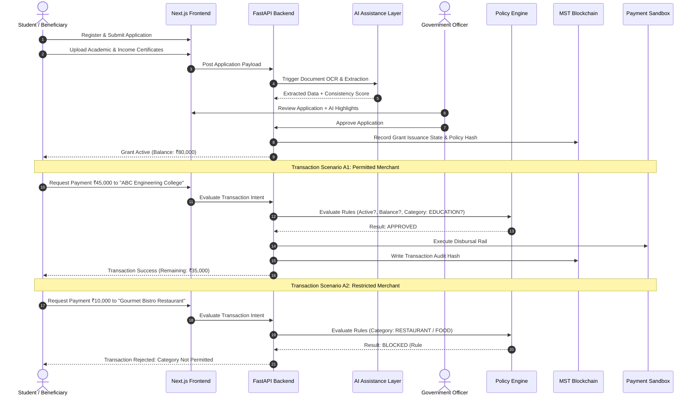
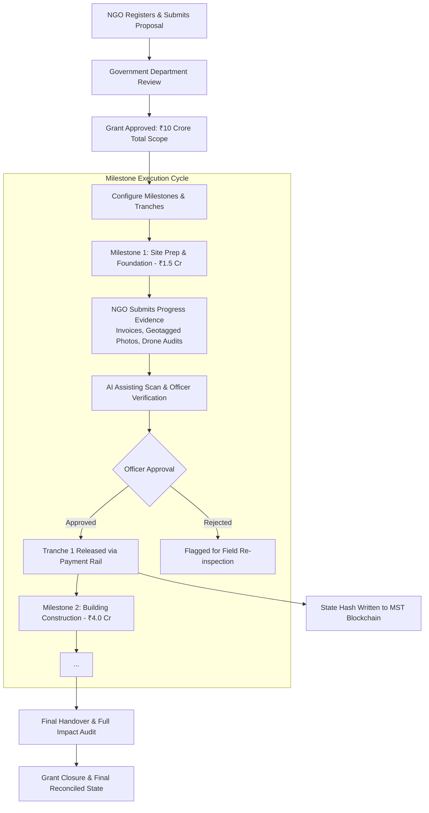
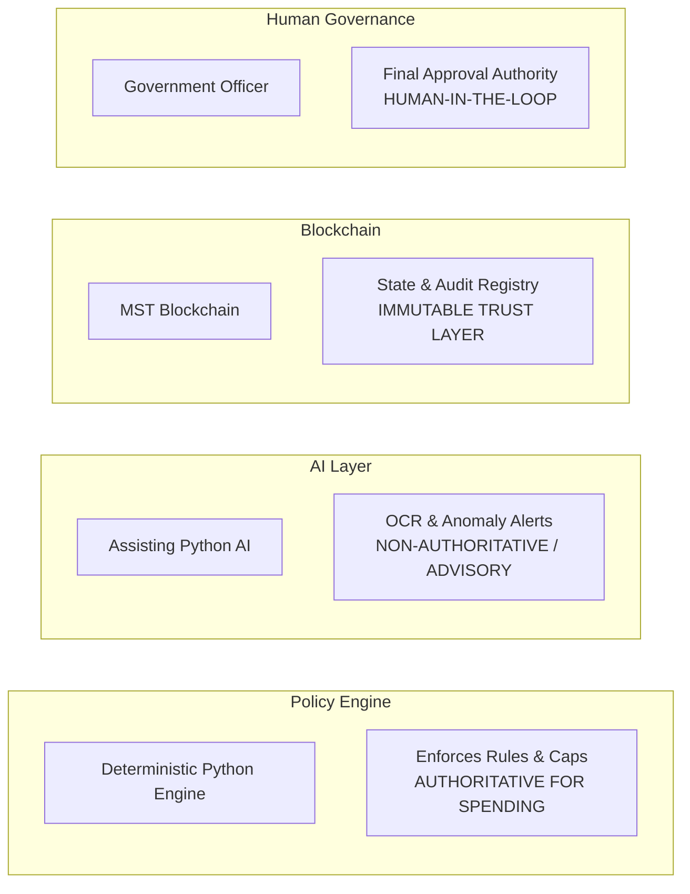
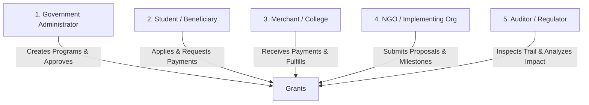
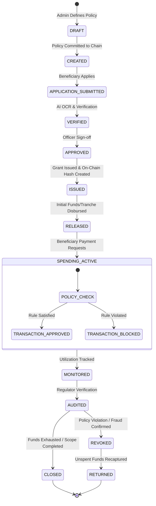

# GrantOS
> **Programmable Public-Fund Infrastructure**

GrantOS is an end-to-end grant-management and governance platform engineered to manage the complete lifecycle of purpose-specific public funding. By combining deterministic policy enforcement, AI-assisted verification, tamper-resistant blockchain audit trails, and flexible payment abstraction, GrantOS transforms static money transfers into programmable, verifiable, and policy-governed public grants.

---

## 📋 Table of Contents

1. [Executive Summary](#-executive-summary)
2. [Product Positioning & Boundaries](#-product-positioning--boundaries)
3. [The Core Problem](#-the-core-problem)
4. [Central Concept: Programmable Grants](#-central-concept-programmable-grants)
5. [Primary Workflows](#-primary-workflows)
   - [Workflow A: Student Education Grant](#workflow-a-student-education-grant-primary)
   - [Workflow B: NGO Rural Development Grant](#workflow-b-ngo-rural-development-grant-secondary)
6. [Component Authority & Responsibilities](#-component-authority--responsibilities)
   - [Deterministic Policy Engine](#1-deterministic-policy-engine)
   - [AI Assistance Layer](#2-ai-assistance-layer)
   - [MST Blockchain & Smart Contracts](#3-mst-blockchain--smart-contracts)
   - [Payment Abstraction Layer](#4-payment-abstraction-layer)
7. [System Architecture](#-system-architecture)
8. [Privacy & Off-Chain Data Model](#-privacy--off-chain-data-model)
9. [Technology Stack](#-technology-stack)
10. [User Roles & RBAC](#-user-roles--rbac)
11. [Grant Lifecycle State Machine](#-grant-lifecycle-state-machine)
12. [MVP Scope & Boundaries](#-mvp-scope--boundaries)
13. [Implementation Phases & Roadmap](#-implementation-phases--roadmap)
14. [Development Philosophy](#-development-philosophy)
15. [Current Project Status](#-current-project-status)

---

## 🎯 Executive Summary

A public grant is **not** merely money transferred from an authorized government account to a beneficiary. A legitimate public grant possesses:
- A verified **beneficiary**
- A specific **purpose**
- **Eligibility requirements** & supporting credentials
- Enforceable **spending rules** & merchant category restrictions
- **Spending limits** & quota caps
- Configurable **validity & expiry**
- Real-time **monitoring requirements**
- Cryptographic **audit trails**
- **Milestone-based release conditions** (for multi-phase project grants)

**GrantOS brings all these elements together into a unified infrastructure.** The platform empowers government departments, public institutions, and international funding bodies to issue, govern, disburse, monitor, audit, and analyze purpose-specific grants with absolute transparency and zero leakage.

---

## 🛡️ Product Positioning & Boundaries

To eliminate ambiguity, GrantOS explicitly defines its boundary within the financial and technology ecosystem:

```
┌─────────────────────────────────────────────────────────┐
│                      PAYMENT RAIL                       │
│        (e₹ / CBDC  |  UPI  |  Bank Transfer)            │
└────────────────────────────┬────────────────────────────┘
                             │ Moves Actual Fiat Money
                             ▼
┌─────────────────────────────────────────────────────────┐
│                    ACTUAL MONETARY VALUE                │
│                 (Legal Fiat Currency - ₹ INR)           │
└────────────────────────────┬────────────────────────────┘
                             │ Governed & Monitored By
                             ▼
┌─────────────────────────────────────────────────────────┐
│                         GRANTOS                         │
│  ┌───────────────────────────────────────────────────┐  │
│  │ Grant Governance & Administration                 │  │
│  │ Deterministic Policy Engine (Rule Evaluation)     │  │
│  │ AI-Assisted Document & Anomaly Verification        │  │
│  │ MST Blockchain Audit Trail & Lifecycle State      │  │
│  └───────────────────────────────────────────────────┘  │
└─────────────────────────────────────────────────────────┘
```

### Critical Positioning Declarations:
* **NOT a Cryptocurrency or Token**: GrantOS does **not** create a custom token, coin, or alternative currency. All grant balances reflect real legal fiat currency (e.g., ₹ INR).
* **NOT a Bank or Payment Processor**: GrantOS does **not** hold custody of funds or operate as a licensed financial institution.
* **Management & Policy Layer**: GrantOS functions as the **governance, verification, policy evaluation, monitoring, and auditing orchestration layer** sitting above existing payment infrastructure.
* **Sandbox & Payment Rail Compatibility**: In production, GrantOS connects to authorized rails (e₹/CBDC, UPI, Direct Benefit Transfer). For hackathons and demonstrations, GrantOS uses a controlled **Mock Payment & Merchant Sandbox Adapter**.

---

## ❓ The Core Problem

Traditional public grant administration relies on fragmented, manual, and disconnected systems:

```
┌──────────────┐     ┌──────────────┐     ┌──────────────┐     ┌──────────────┐
│ Applications │ ──► │ Paper Docs   │ ──► │ Approvals    │ ──► │ Bank Outward │
└──────────────┘     └──────────────┘     └──────────────┘     └──────────────┘
                                                                      │
┌──────────────┐     ┌──────────────┐     ┌──────────────┐            │ Money Leaves
│ Field Audit  │ ◄── │ Utilization  │ ◄── │ Cash/Bank    │ ◄──────────┘ System
└──────────────┘     └──────────────┘     └──────────────┘
```

### Key Failures of Legacy Grant Systems:
1. **Capital Misallocation**: Once money is transferred to a bank account, it becomes indistinguishable from other funds, enabling off-target spending (e.g., spending an education grant on entertainment or personal shopping).
2. **High Fraud & Duplication**: Document forgery, fake identities, and double-dipping across schemes cannot be easily detected in manual pipelines.
3. **Unchecked Bulk Releases**: NGO/Infrastructure grants are often disbursed upfront in large lump sums without verifiable proof of physical progress.
4. **Opaque Audit Trails**: Post-spending audits occur months or years later, relying on paper receipts susceptible to loss or alteration.

---

## 💡 Central Concept: Programmable Grants

The central innovation of GrantOS is **Programmable Grants**. A grant is encapsulated as a smart policy contract bound to fiat monetary value:

$$\text{Grant} = \text{Money} + \text{Beneficiary} + \text{Purpose} + \text{Rules} + \text{Validity} + \text{Conditions} + \text{Monitoring} + \text{Auditability}$$

### Concrete Example: Student Education Grant
- **Total Allocation**: ₹80,000
- **Purpose**: Higher Technical Education
- **Beneficiary**: Student `#STU-2026-8891`
- **Allowed Categories**: College Tuition Fees, Academic Textbooks, Educational Laptop/Hardware, Lab Equipment.
- **Restricted Categories**: Dining/Restaurants, Entertainment/Movies, Alcohol/Tobacco, Personal Fashion Shopping, Electronics (Non-Educational).
- **Single Transaction Cap**: ₹50,000
- **Grant Expiry**: July 31, 2027

---

## 🔄 Primary Workflows

GrantOS natively supports two primary workflows that showcase its versatility across small-scale individual grants and large-scale organizational grants.

### Workflow A: Student Education Grant (Primary)

Demonstrates real-time category validation, deterministic policy evaluation, and approved vs. blocked transaction execution.



#### Expected Outcome Demonstration:
| Transaction | Target Merchant | Amount | Merchant Category | Policy Engine Result | Rule Evaluation |
| :--- | :--- | :--- | :--- | :--- | :--- |
| **A1** | ABC Engineering College | ₹45,000 | `EDUCATION_TUITION` | `APPROVED` | Valid active grant, balance available (₹80,000), verified educational merchant, category allowed. |
| **A2** | Gourmet Bistro | ₹10,000 | `RESTAURANT_DINING` | `BLOCKED` | Category `RESTAURANT_DINING` is strictly prohibited under Education Policy #EDU-2026. |

---

### Workflow B: NGO Rural Development Grant (Secondary)

Demonstrates multi-stage, milestone-driven funding releases for large-scale public infrastructure projects.



#### Sample Milestone Structure (Rural School Infrastructure — ₹10 Crore):
1. **Milestone 1 (Land Prep & Excavation)**: ₹1.5 Crore — Triggered by geotagged site clearance certificate & surveyor report.
2. **Milestone 2 (Structural Foundation)**: ₹2.5 Crore — Triggered by structural engineer sign-off & material invoices.
3. **Milestone 3 (Building Construction)**: ₹3.5 Crore — Triggered by visual inspection photos & safety compliance certs.
4. **Milestone 4 (Equipment & Furnishing)**: ₹1.5 Crore — Triggered by equipment procurement bills & lab installation verification.
5. **Milestone 5 (Final Handover & Audit)**: ₹1.0 Crore — Triggered by municipal completion certificate & operational verification.

---

## 🏛️ Component Authority & Responsibilities

GrantOS enforces a strict separation of powers between system components to prevent single points of failure, unexplainable decisions, or security lapses.



### 1. Deterministic Policy Engine
* **Responsibility**: Strict, zero-variance rule evaluation.
* **Authority**: **Absolute and authoritative for transaction approvals and rejections.**
* **Evaluation Criteria**:
  1. Is the grant active and unexpired?
  2. Is the beneficiary verified and in good standing?
  3. Is there sufficient unencumbered grant balance?
  4. Is the receiving merchant verified and assigned an approved category code?
  5. Is the merchant category explicitly listed in allowed policy categories?
  6. Does the transaction satisfy single-transaction and daily spending caps?
  7. Are all milestone release conditions satisfied (for multi-phase grants)?
* **Output**: Pure boolean decision (`APPROVED` or `BLOCKED`) with structured, human-readable reason codes.

### 2. AI Assistance Layer
* **Responsibility**: Document OCR, structured text extraction, cross-document consistency checks, application summarization, anomaly detection, suspicious evidence flagging, risk scoring.
* **Authority**: **Advisory only.**
* **Strict Rule**: **AI NEVER independently rejects an applicant, revokes a grant, or accuses a user of fraud.** AI outputs are presented as risk flags or confidence scores to human government officers for final determination.

### 3. MST Blockchain & Smart Contracts
* **Responsibility**: Maintaining an immutable ledger of grant definitions, state transitions, milestone approvals, tranche releases, policy hash proofs, and transaction cryptographic references.
* **Authority**: **Verifiable single source of truth for grant state and audit trails.**
* **Privacy Boundary**: **NO sensitive personal identifiable information (PII) is stored on-chain.** Only cryptographic hashes, grant UUIDs, state enums, and timestamp proofs are committed to the blockchain.

### 4. Payment Abstraction Layer
* **Responsibility**: Translating approved GrantOS transactions into actual settlement commands over underlying financial rails.
* **Supported Adapters**:
  - `CBDCAdapter` (e₹ integration where available)
  - `UPIAdapter` (Virtual Payment Address routing)
  - `BankDBTAdapter` (Direct Benefit Transfer via RTGS/NEFT/IMPS)
  - `SandboxPaymentAdapter` (Mock payment execution engine for hackathon/demo environments)

---

## 🏗️ System Architecture

```
                                    USERS
                                      │
               ┌──────────────────────┼──────────────────────┐
               │                      │                      │
        Government Admin      Student / NGO             Auditor
               │                      │                      │
               └──────────────────────┼──────────────────────┘
                                      │
                                      ▼
                      ┌───────────────────────────────┐
                      │    NEXT.JS FRONTEND APP       │
                      │  (TypeScript, Tailwind, UI)   │
                      └───────────────┬───────────────┘
                                      │ REST API / HTTPS
                                      ▼
                      ┌───────────────────────────────┐
                      │    FASTAPI BACKEND SERVICE    │
                      │   (Python Core API Engine)    │
                      └───────────────┬───────────────┘
                                      │
         ┌────────────────────────────┼────────────────────────────┐
         │                            │                            │
         ▼                            ▼                            ▼
┌─────────────────┐          ┌─────────────────┐          ┌─────────────────┐
│  POSTGRESQL DB  │          │   AI SERVICE    │          │  POLICY ENGINE  │
│ (Relational Data│          │ (OCR, Extraction│          │ (Deterministic  │
│  & Off-Chain)   │          │  & Anomalies)   │          │ Rule Assessor)  │
└─────────────────┘          └─────────────────┘          └────────┬────────┘
         │                                                         │
         └────────────────────────────┬────────────────────────────┘
                                      │
                                      ▼
                      ┌───────────────────────────────┐
                      │   MST BLOCKCHAIN INTEGRATOR   │
                      │   (Hardhat, ethers.js, Web3)  │
                      └───────────────┬───────────────┘
                                      │
                                      ▼
                      ┌───────────────────────────────┐
                      │    SOLIDITY SMART CONTRACTS   │
                      │ (GrantRegistry, MilestoneEscrow)
                      └───────────────┬───────────────┘
                                      │ State Commitments
                                      ▼
                      ┌───────────────────────────────┐
                      │        MST BLOCKCHAIN         │
                      │    (Immutable Audit Layer)    │
                      └───────────────────────────────┘
                                      │
                                      ▼
                      ┌───────────────────────────────┐
                      │  PAYMENT ABSTRACTION ADAPTER  │
                      └───────────────┬───────────────┘
                                      │
         ┌────────────────────────────┼────────────────────────────┐
         ▼                            ▼                            ▼
  e₹ / CBDC Rail                 UPI Rail                   Sandbox Adapter
```

---

## 🔒 Privacy & Off-Chain Data Model

To ensure strict compliance with global privacy standards (e.g., DPDP Act, GDPR), GrantOS segregates sensitive off-chain data from public on-chain verifiable records:

```
┌──────────────────────────────────────────┐    ┌──────────────────────────────────────────┐
│             OFF-CHAIN DATA               │    │         ON-CHAIN / VERIFIABLE            │
│          (PostgreSQL / S3 Vault)         │    │             (MST Blockchain)             │
├──────────────────────────────────────────┤    ├──────────────────────────────────────────┤
│ • Full Applicant Names & Addresses       │    │ • Grant Program ID (UUID Hash)           │
│ • Identity Documents (Aadhaar/PAN/Pass)  │    │ • Beneficiary Anonymous Reference Hash   │
│ • Income Certificates & Tax Returns      │    │ • Policy Specification Hash              │
│ • Bank Account Numbers & IFSCs           │    │ • Current Grant Lifecycle State          │
│ • Detailed Invoices & Receipts           │    │ • Approved Transaction Cryptographic Proof│
│ • Site Photos & Drone Footage            │    │ • Milestone Verification Signatures      │
│ • AI Raw Extraction Logs                 │    │ • Tranche Release Event Hashes           │
└──────────────────────────────────────────┘    └──────────────────────────────────────────┘
```

---

## 🛠️ Technology Stack

| Architecture Layer | Core Technologies | Purpose & Rationale |
| :--- | :--- | :--- |
| **Frontend UI** | **Next.js**, TypeScript, Tailwind CSS, shadcn/ui | Modern, responsive, highly styled user interface with micro-interactions. |
| **Backend API** | **FastAPI**, Python 3.11+, Pydantic | High-performance asynchronous API layer with auto-generated OpenAPI docs. |
| **Database & ORM** | **PostgreSQL**, SQLAlchemy 2.0, Alembic | Relational data persistence, relational integrity, schema migrations. |
| **Authentication** | **Firebase Authentication** / JWT | Secure multi-tenant authentication supporting Role-Based Access Control. |
| **Policy Engine** | Custom Python Engine | Pure, deterministic rule evaluation logic with clear decision logs. |
| **AI Processing** | Python, EasyOCR/Tesseract, LLM extraction APIs | Document text extraction, field matching, anomaly detection assistance. |
| **Smart Contracts** | **Solidity**, Hardhat, ethers.js | Smart contract development, testing, and deployment to MST Blockchain. |
| **Blockchain** | **MST Blockchain** | Immutable grant state registry, milestone escrow, transparent audit trail. |
| **File Storage** | Cloudflare R2 / S3-compatible | Encrypted document, receipt, and evidence storage. |
| **Analytics UI** | Recharts / ECharts | Interactive charts for grant utilization, impact analysis, and audit metrics. |
| **Payment Layer** | Payment Abstraction Layer + Sandbox | Pluggable settlement bridge separating governance from payment rails. |

---

## 👥 User Roles & RBAC

GrantOS defines five explicit system roles:



1. **Government Administrator**: Creates grant programs, configures spending policies, sets eligibility thresholds, reviews AI-assisted applications, authorizes grant issuance, approves milestone tranches, monitors program impact.
2. **Beneficiary / Student**: Registers profile, uploads eligibility documents, applies for grant schemes, tracks application status, views available balances, initiates permitted payments to verified merchants.
3. **College / Merchant**: Maintains verified identity and category code (MCC), accepts authorized grant payments, provides transaction line-item details where required.
4. **NGO / Implementing Organization**: Registers organization, submits multi-milestone proposals, executes project phases, uploads verification evidence (bills, site photos), requests milestone tranche releases.
5. **Auditor / Regulator**: Reads complete immutable audit trail, verifies state transition proofs against MST Blockchain, inspects anomaly flags, evaluates fiscal impact reports.

---

## 🔄 Grant Lifecycle State Machine

Every grant program, beneficiary allocation, and milestone tranche in GrantOS advances through a deterministic lifecycle state machine:



---

## 🎯 MVP Scope & Boundaries

### Included in Hackathon MVP:
- [x] Complete **Phase 0 Constitution & Documentation** suite.
- [x] **Workflow A (Student Education Grant)** vertical slice: Application $\rightarrow$ AI Document Check $\rightarrow$ Officer Approval $\rightarrow$ Disbursement $\rightarrow$ **Approved vs. Blocked Spending Demo**.
- [x] **Workflow B (NGO Milestone Grant)** vertical slice: Proposal $\rightarrow$ Milestone Definition $\rightarrow$ Evidence Upload $\rightarrow$ Verification $\rightarrow$ Tranche Release.
- [x] **Custom Deterministic Policy Engine** evaluating merchant category, active status, caps, and balance.
- [x] **Assisting AI Service** executing document extraction and generating risk scores.
- [x] **Solidity Smart Contracts** deployed to MST Blockchain test environment storing grant state hashes and milestone logs.
- [x] **Interactive Auditor Dashboard** with immutable proof verification.
- [x] **Mock Payment & Merchant Sandbox Adapter** simulating real-time merchant settlement.

### Explicitly Out of Scope for MVP:
- Production banking integrations or live bank gateway keys.
- Real-world Aadhaar / PAN API integrations (simulated with mock verification payloads).
- Production e₹ / CBDC live mainnet integrations.
- Native cryptocurrency token issuance or tokenomics.
- Microservice architecture over-engineering (monolithic FastAPI backend is intentional for MVP).

---

## 📅 Implementation Phases & Roadmap

GrantOS development follows an 18-phase structured blueprint. **Only Phase 0 is active.**

```
Phase 0 ──► Phase 1 ──► Phase 2 ──► Phase 3 ──► Phase 4 ──► Phase 5 ──► Phase 6
[CURRENT]  Repo Setup   Database    Auth/Roles  Gov Admin   Student/AI  Policy Eng
                                                                           │
Phase 13 ◄─ Phase 12 ◄─ Phase 11 ◄─ Phase 10 ◄─ Phase 9 ◄── Phase 8 ◄── Phase 7
AI Anomaly NGO Micro   Chain Audit MST Integration Contracts Balance Model Merchant Sim
    │
    ▼
Phase 14 ──► Phase 15 ──► Phase 16 ──► Phase 17 ──► Phase 18
Auditor UI   Security     Integration  Demo Eng    Deployment
```

*For complete phase breakdown, deliverables, and acceptance criteria, see [DEVELOPMENT_ROADMAP.md](file:///d:/Projects/GrantOS/docs/DEVELOPMENT_ROADMAP.md).*

---

## 🧠 Development Philosophy

1. **Deterministic Rule Enforcement**: Financial rules must be 100% predictable, explainable, and testable. AI never acts as a deterministic gatekeeper.
2. **Human-in-the-Loop Governance**: AI enhances efficiency; human officers retain final accountability for public fund distribution.
3. **Privacy by Design**: Sensitive personal data stays in secure off-chain stores; only cryptographic state proofs touch the blockchain.
4. **Pluggable Financial Rails**: GrantOS remains agnostic to payment technology, ensuring compatibility with present (UPI, Bank DBT) and future (e₹/CBDC) payment infrastructure.
5. **Zero-Trust Auditability**: Every state transition is recorded immutably to empower regulators and citizens.

---

## 📌 Current Project Status

- **Phase 0 Status**: **COMPLETED**
- **Documentation Suite**:
  - [README.md](file:///d:/Projects/GrantOS/README.md) — Main Project Landing Page
  - [PROJECT_CONSTITUTION.md](file:///d:/Projects/GrantOS/docs/PROJECT_CONSTITUTION.md) — Product & Technical Governance Principles
  - [ARCHITECTURE.md](file:///d:/Projects/GrantOS/docs/ARCHITECTURE.md) — Detailed Architecture & Component Specifications
  - [WORKFLOWS.md](file:///d:/Projects/GrantOS/docs/WORKFLOWS.md) — Operational Sequence Walkthroughs & RBAC Matrix
  - [DEVELOPMENT_ROADMAP.md](file:///d:/Projects/GrantOS/docs/DEVELOPMENT_ROADMAP.md) — Comprehensive Phase 0–18 Roadmap
- **Next Authorized Step**: Pending user authorization to begin **Phase 1: Repository & Monorepo Setup**.
