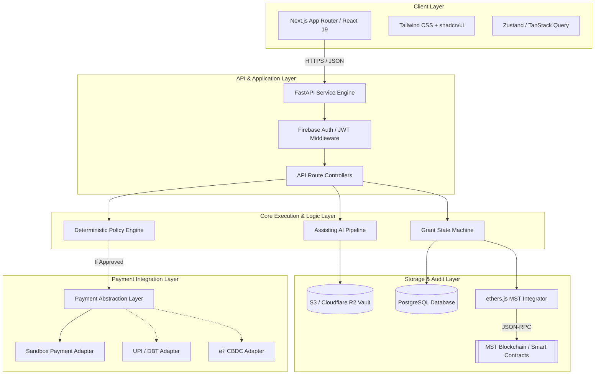
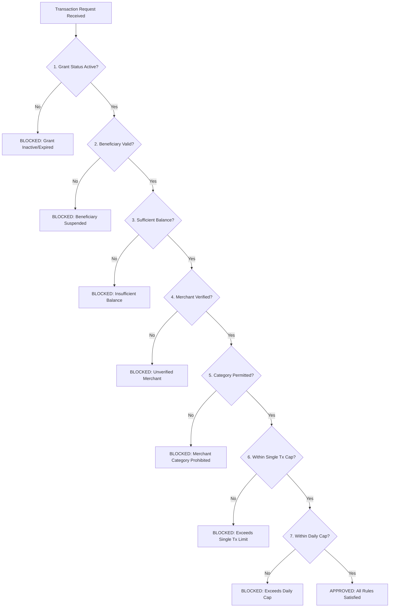

# GrantOS Technical Architecture Specification

> **System Blueprint**  
> **Version**: 1.0.0 (Phase 0)  
> **Target Environment**: Web Application (Next.js + FastAPI + PostgreSQL + Solidity/MST Blockchain)

---

## 📐 1. System Architectural Overview

GrantOS is designed as a multi-layered, privacy-preserving, governance-first application. It separates high-speed user interactions, relational data storage, deterministic rule evaluation, advisory AI scans, smart contract state tracking, and monetary settlement rails into distinct, loosely coupled layers.



---

## 🧱 2. Core Components Specification

### 2.1 Frontend UI Architecture (`Next.js + TypeScript`)
- **Framework**: Next.js 14+ (App Router).
- **Styling**: Vanilla CSS tokens integrated into Tailwind CSS with shadcn/ui component primitives.
- **Visual Palette**: Dark-mode primary design with glassmorphic cards, vibrant accent accents (`#00F2FE` to `#4FACFE`), crisp typography (Inter / Outfit), micro-animations (Framer Motion).
- **Key Modules**:
  - `GovPortal`: Grant program creation, policy builder, application queue, milestone release manager.
  - `StudentPortal`: Scholarship discovery, document upload wizard, active grant card, spending request interface.
  - `NGOPortal`: Project proposal builder, milestone evidence submission, tranche tracking.
  - `MerchantPortal`: Category registration, receipt generation, incoming grant payment verifier.
  - `AuditorDashboard`: Real-time transaction stream, blockchain proof verifier, anomaly alert queue.

---

### 2.2 Backend Service Engine (`FastAPI + Python`)
- **Framework**: FastAPI (Python 3.11+).
- **ORMs & Database**: SQLAlchemy 2.0 (asyncio engine), Alembic schema migration runner, PostgreSQL 16+.
- **Authentication**: Firebase Admin SDK verifying JWT bearer tokens, assigning user roles (`GOV_ADMIN`, `BENEFICIARY_STUDENT`, `NGO_ORG`, `MERCHANT`, `AUDITOR`).
- **Core Endpoints Blueprint**:
  - `/api/v1/grants`: Programs, policies, lifecycle transitions.
  - `/api/v1/applications`: Application submission, OCR triggers, officer approvals.
  - `/api/v1/policy`: Policy evaluation endpoint (`/evaluate`).
  - `/api/v1/milestones`: NGO milestone evidence submission & verification.
  - `/api/v1/blockchain`: Verification hash retrieval & smart contract logs.
  - `/api/v1/payments`: Merchant payment request simulation.

---

### 2.3 Deterministic Policy Engine (`Custom Python Module`)

The Policy Engine is a pure Python module with zero external API dependencies, ensuring sub-millisecond deterministic evaluation.

#### Input Payload Schema:
```json
{
  "grant_id": "GRN-2026-EDU-8812",
  "beneficiary_id": "BEN-99120",
  "requested_amount": 45000.00,
  "merchant": {
    "id": "MER-4410",
    "name": "ABC Engineering College",
    "mcc": "8220",
    "category": "EDUCATION_TUITION",
    "is_verified": true
  },
  "timestamp": "2026-09-20T18:52:15Z"
}
```

#### Policy Evaluation Algorithm:



#### Output Payload Schema:
```json
{
  "status": "APPROVED",
  "evaluation_id": "EVAL-7712-9901",
  "grant_id": "GRN-2026-EDU-8812",
  "requested_amount": 45000.00,
  "remaining_balance_after": 35000.00,
  "rules_evaluated": [
    {"rule": "GRANT_ACTIVE_CHECK", "passed": true},
    {"rule": "BENEFICIARY_VALIDITY", "passed": true},
    {"rule": "BALANCE_CHECK", "passed": true, "available": 80000.00},
    {"rule": "MERCHANT_VERIFICATION", "passed": true},
    {"rule": "CATEGORY_RESTRICTION", "passed": true, "category": "EDUCATION_TUITION"},
    {"rule": "SINGLE_TX_CAP", "passed": true, "cap": 50000.00}
  ],
  "decision_reason": "Transaction satisfies all policy criteria under Education Grant Policy #EDU-2026."
}
```

---

### 2.4 AI Assistance Pipeline


- **Document Processing**: EasyOCR extracts text from marksheet PDFs, income certificates, and invoices.
- **Field Matching**: Fuzzy string matching checks applicant name on marksheet against registered profile.
- **Anomaly Detection**: Flags duplicate document uploads across different applications or abnormal spending spikes.
- **Risk Score Output**: Output is stored in PostgreSQL as `ai_risk_score` and displayed in the Government Officer approval queue.

---

### 2.5 Smart Contracts & MST Blockchain Layer

Written in Solidity 0.8.24 and deployed via Hardhat to the MST Blockchain environment.

#### Smart Contract Architecture:

```
┌─────────────────────────────────────────────────────────┐
│                   GrantRegistry.sol                     │
│  - Storage: ProgramHashes, BeneficiaryStates, Hashes    │
│  - Functions: createGrant(), recordIssuance(),          │
│               recordTransactionHash(), updateState()    │
└────────────────────────────┬────────────────────────────┘
                             │
                             ▼
┌─────────────────────────────────────────────────────────┐
│                 MilestoneEscrow.sol                     │
│  - Storage: ProjectMilestones, TrancheStatus, Proofs    │
│  - Functions: configureMilestones(), submitEvidence(),  │
│               approveMilestone(), releaseTranche()      │
└─────────────────────────────────────────────────────────┘
```

#### On-Chain vs. Off-Chain Data Mapping Table:

| Entity Field | Storage Location | On-Chain Format / Proof |
| :--- | :--- | :--- |
| **Applicant Full Name** | PostgreSQL (Encrypted) | `bytes32 beneficiary_hash = keccak256(UUID + Salt)` |
| **Income Certificate PDF** | Cloudflare R2 / S3 | `bytes32 doc_hash = sha256(pdf_bytes)` |
| **Grant Total Amount** | PostgreSQL + Smart Contract | `uint256 total_allocation_in_paisa` |
| **Grant Policy Categories** | PostgreSQL + Smart Contract | `bytes32 policy_rules_ipfs_hash` |
| **Merchant Name & Account** | PostgreSQL | `bytes32 merchant_reference_hash` |
| **Transaction Audit Proof** | Smart Contract | `struct TxProof { bytes32 tx_hash, uint256 amount, uint8 status, uint256 timestamp }` |

---

### 2.6 Payment Abstraction Layer (PAL)

The Payment Abstraction Layer provides a unified interface separating GrantOS policy authorization from monetary settlement.

```python
class PaymentAdapter(ABC):
    @abstractmethod
    async def execute_transfer(
        self, 
        grant_id: str, 
        beneficiary_id: str, 
        merchant_account: str, 
        amount: float,
        policy_approval_proof: str
    ) -> PaymentResult:
        pass
```

- **`SandboxPaymentAdapter`**: Included in MVP. Simulates instantaneous settlement, updates mock merchant balances, and returns mock bank reference transaction IDs (`TXN-MOCK-9918237`).
- **`eRupeeCBDCAdapter`**: Stub implementation for future CBDC rail connectivity.
- **`UPIDirectAdapter`**: Stub implementation for future NPCI UPI rail connectivity.

---

## 🛡️ 3. Security & Cryptographic Verifiability

1. **Tamper Detection**: Every transaction approved by the Policy Engine generates a cryptographic hash:
   $$\text{TxHash} = \text{SHA256}(\text{GrantID} \parallel \text{MerchantID} \parallel \text{Amount} \parallel \text{Timestamp} \parallel \text{PrevTxHash})$$
2. **Chain Anchoring**: The `TxHash` is dispatched asynchronously to `GrantRegistry.sol` on the MST Blockchain, creating a merkle-linked audit chain.
3. **Auditor Verification**: The Auditor Dashboard fetches the off-chain transaction record from FastAPI and re-computes `TxHash`. It then queries the MST Blockchain contract to verify that the hash matches the on-chain recorded hash, visually displaying a **"VERIFIED ON-CHAIN"** badge.

---

*Architectural Specification Complete for Phase 0.*
