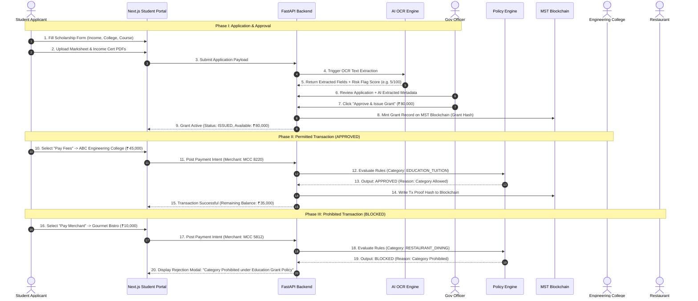

# GrantOS Operational Workflows & User Roles

> **Detailed Operational Walkthroughs & RBAC Matrix**  
> **Version**: 1.0.0 (Phase 0)

---

## 🎓 1. WORKFLOW A: STUDENT EDUCATION GRANT (PRIMARY MVP WORKFLOW)

Workflow A demonstrates individual grant issuance, AI document verification assistance, government officer approval, and real-time category validation through the Policy Engine.

---

### 1.1 Step-by-Step Lifecycle Walkthrough



---

### 1.2 Concrete Demonstration Payloads

#### Scenario A1: APPROVED Payment Payload Trace
```json
// Request Payload to Policy Engine
{
  "grant_id": "GRN-2026-EDU-8812",
  "beneficiary_id": "STU-889102",
  "requested_amount": 45000.00,
  "merchant": {
    "merchant_id": "MER-COLLEGE-001",
    "name": "ABC Engineering College",
    "mcc": "8220",
    "category": "EDUCATION_TUITION",
    "verified_status": true
  }
}

// Policy Engine Evaluation Result
{
  "status": "APPROVED",
  "evaluation_timestamp": "2026-09-20T18:52:15Z",
  "policy_name": "National Higher Education Scholarship Policy 2026",
  "rule_check_summary": {
    "is_grant_active": true,
    "is_beneficiary_valid": true,
    "is_merchant_verified": true,
    "is_category_permitted": true,
    "sufficient_balance": true,
    "single_tx_cap_satisfied": true
  },
  "financial_summary": {
    "previous_balance": 80000.00,
    "approved_deduction": 45000.00,
    "new_available_balance": 35000.00
  },
  "blockchain_anchor": {
    "tx_proof_hash": "0xa1b2c3d4e5f67890123456789abcdef0123456789abcdef0123456789abcdef0",
    "block_status": "COMMITTED_TO_MST"
  }
}
```

#### Scenario A2: BLOCKED Payment Payload Trace
```json
// Request Payload to Policy Engine
{
  "grant_id": "GRN-2026-EDU-8812",
  "beneficiary_id": "STU-889102",
  "requested_amount": 10000.00,
  "merchant": {
    "merchant_id": "MER-REST-4412",
    "name": "Gourmet Bistro Restaurant",
    "mcc": "5812",
    "category": "RESTAURANT_DINING",
    "verified_status": true
  }
}

// Policy Engine Evaluation Result
{
  "status": "BLOCKED",
  "evaluation_timestamp": "2026-09-20T18:54:02Z",
  "policy_name": "National Higher Education Scholarship Policy 2026",
  "failed_rule": {
    "rule_code": "PROHIBITED_MERCHANT_CATEGORY",
    "requested_category": "RESTAURANT_DINING",
    "allowed_categories": [
      "EDUCATION_TUITION",
      "BOOKS_STATIONERY",
      "LAPTOP_HARDWARE",
      "LAB_EQUIPMENT"
    ]
  },
  "reason": "Transaction rejected. Merchant category 'RESTAURANT_DINING' is not permitted under the Education Grant policy.",
  "financial_summary": {
    "current_balance": 35000.00,
    "deduction": 0.00
  }
}
```

---

## 🏗️ 2. WORKFLOW B: NGO RURAL DEVELOPMENT GRANT (SECONDARY MVP WORKFLOW)

Workflow B demonstrates multi-phase, milestone-gated public infrastructure funding for non-governmental implementing organizations.

---

### 2.1 Step-by-Step Milestone Release Lifecycle

```mermaid
graph TD
    Proposal[1. NGO Submits Proposal & Milestone Schedule] --> Review[2. Gov Officer Reviews Proposal]
    Review --> GrantApprove[3. Grant Approved: ₹10 Crore Scope]
    GrantApprove --> InitEscrow[4. MilestoneEscrow Contract Initialized on MST]
    
    subgraph Milestone 1 Cycle: Land Prep & Excavation (₹1.5 Cr)
        InitEscrow --> M1_Exec[5. NGO Executes Land Prep Work]
        M1_Exec --> M1_Sub[6. NGO Uploads Evidence: Site Photos, Soil Tests, Invoices]
        M1_Sub --> M1_AI[7. AI Scans Invoices & Geotag Verification]
        M1_AI --> M1_Officer[8. Gov Officer Inspects Evidence & Approves]
        M1_Officer --> M1_Rel[9. Tranche 1 Released (₹1.5 Cr) via Payment Rail]
        M1_Rel --> M1_Hash[10. Tranche Release Event Committed to MST Blockchain]
    end

    subgraph Milestone 2 Cycle: Building Construction (₹4.0 Cr)
        M1_Hash --> M2_Exec[11. NGO Executes Construction Work]
        M2_Exec --> M2_Sub[12. NGO Uploads Evidence: Construction Photos & Audit Certs]
        M2_Sub --> M2_Officer[13. Officer Approves Milestone 2]
        M2_Officer --> M2_Rel[14. Tranche 2 Released (₹4.0 Cr)]
    end

    M2_Rel --> FutureMilestones[...]
    FutureMilestones --> FinalHandover[15. Final Handover & Audit -> Grant CLOSED]
```

---

## 🔐 3. ROLE-BASED ACCESS CONTROL (RBAC) MATRIX

GrantOS enforces a strict granular permission matrix across all system endpoints and views:

| Action / Capability | Government Admin | Beneficiary (Student) | Merchant / College | NGO / Implementer | Auditor / Regulator |
| :--- | :---: | :---: | :---: | :---: | :---: |
| **Create Grant Program** | ✅ | ❌ | ❌ | ❌ | ❌ |
| **Configure Policy Rules & Caps** | ✅ | ❌ | ❌ | ❌ | ❌ |
| **Submit Grant Application** | ❌ | ✅ | ❌ | ✅ | ❌ |
| **Upload Identity / Income Proofs** | ❌ | ✅ | ❌ | ✅ | ❌ |
| **Trigger AI OCR Scan** | Auto | Auto | ❌ | Auto | ❌ |
| **Review & Approve Applications** | ✅ | ❌ | ❌ | ❌ | ❌ |
| **Initiate Spending Request** | ❌ | ✅ | ❌ | ❌ | ❌ |
| **Execute Policy Rule Check** | System | System | System | System | ❌ |
| **Accept Grant Payment** | ❌ | ❌ | ✅ | ❌ | ❌ |
| **Submit Milestone Evidence** | ❌ | ❌ | ❌ | ✅ | ❌ |
| **Approve Milestone & Release Tranche**| ✅ | ❌ | ❌ | ❌ | ❌ |
| **View Audit Trail & Proof Hashes** | ✅ | ✅ (Own) | ✅ (Own) | ✅ (Own) | ✅ (Full) |
| **Export Regulatory Compliance Reports**| ✅ | ❌ | ❌ | ❌ | ✅ |

---

*Workflows and Permission Matrix Specification Complete for Phase 0.*
